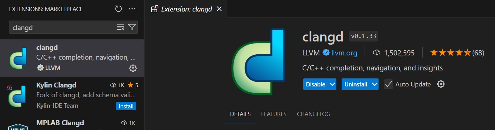
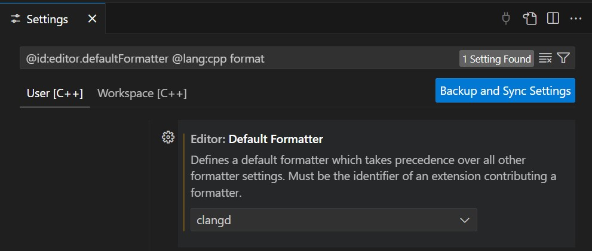
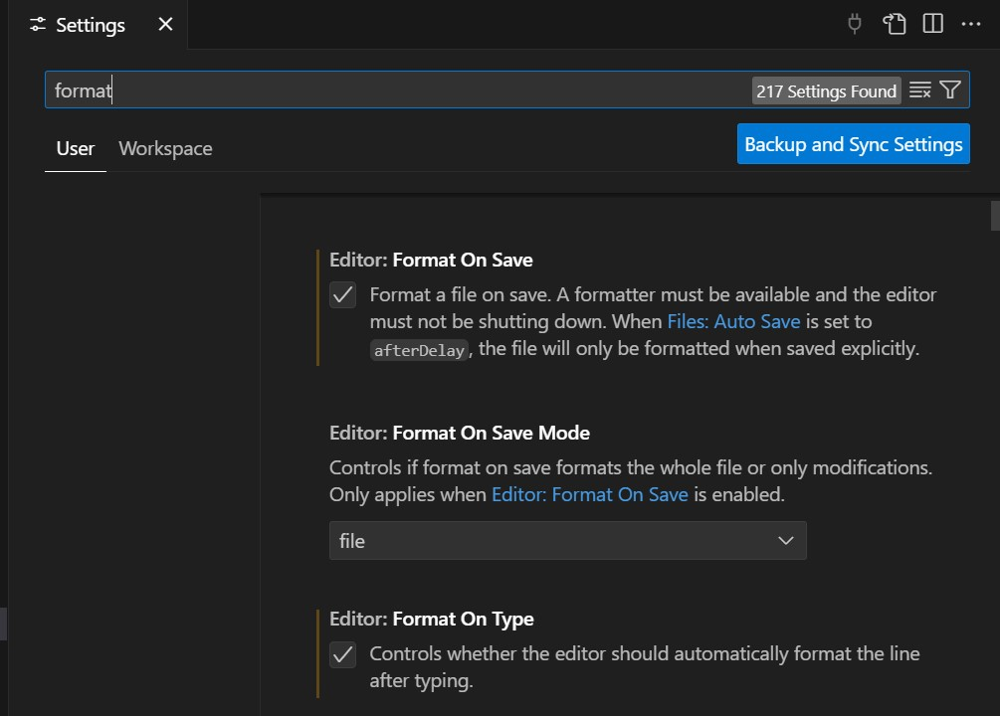

## Coding style

To keep the source code clean and tidy we use `clangd` in combination with the `.clang-format` configuration file.

### Github Action Format Check

Additionally every push and pull request will trigger a `Github Action` to check the formatting on all the source code.
The output of the action should be `inspected` and the requested changes should be `applied` prior merging.

### Using clangd locally

1. To use `clangd` locally it is preferably installed via `Visual Studio Code Extensions`.
2. Install the extension from the `Extension Marketplace`.

3. Configure your IDE to use the clangd formatter properly.

4. Make your changes to the code and save the file to apply the formatting automatically.
